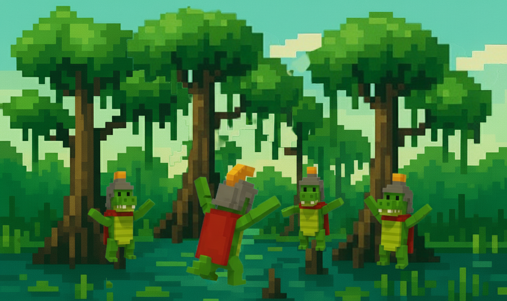

# GatorOS Documentation

Welcome to the official documentation for **GatorOS** - the operating system for the Gator ecosystem on Avalanche.

## What is GatorOS?

GatorOS is a web-based desktop environment that brings the power of DeFi and blockchain interactions to your browser. Built specifically for the Gator token ecosystem, it provides an intuitive, Windows-like interface for managing your crypto assets, trading tokens, and participating in the Gator community.

## What is Gator?

**Gator (GATOR)** is a meme token deployed on the **Arena** platform on the **Avalanche** blockchain. Inspired by the iconic Florida gator, Gator combines the fun of meme culture with the utility of DeFi, offering:

- Community-driven governance
- Liquidity rewards
- Staking opportunities
- NFT integrations
- Cross-chain bridges

## Key Features

- **Desktop Interface**: Familiar Windows-style OS in your browser
- **Built-in DeFi Apps**: Swap, Treasury management, Profile tracking
- **Wallet Integration**: Seamless connection with MetaMask, WalletConnect
- **Real-time Data**: Live prices, balances, and market information
- **Community Features**: Arena integration, social interactions
- **Video Advertising**: Integrated ad system for revenue sharing

## Quick Start

1. Visit [GatorOS](https://gatoros.com)
2. Connect your wallet
3. Start exploring the desktop environment
4. Use the built-in apps to interact with DeFi

## Community

Join the Gator community:
- [Arena Community](https://arena.social/community/0x1A31A8fD8BACB64b32dBcdcF5b2215f58Baf70c1)
- [Telegram](https://t.me/gator_token)
- [Twitter](https://twitter.com/gator_token)

## Support

For support and questions:
- [GitHub Issues](https://github.com/Airpote/gatoor/issues)
- [Discord](https://discord.gg/gator)

---

*Built with ❤️ for the Gator community on Avalanche*
